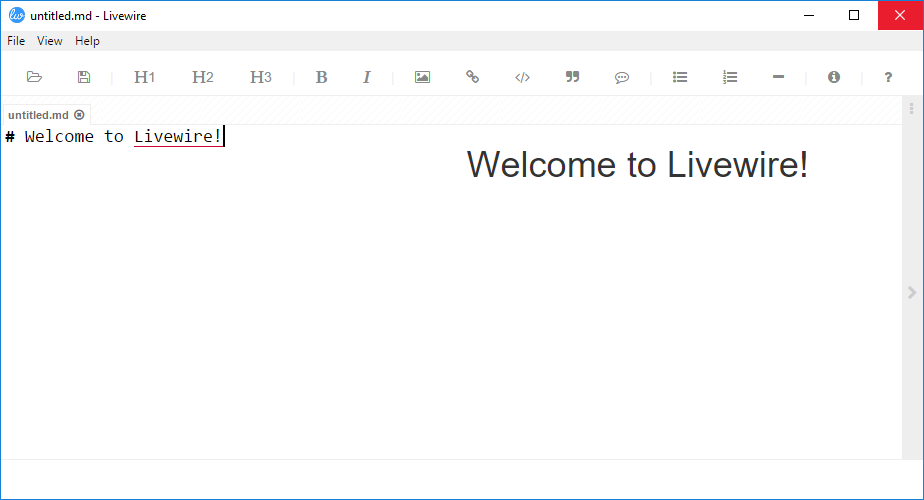

# Livewire

A simple web content editor built with [Electron](electron.atom.io).

## Features
1. **Multiple Formats**: Supports both [AsciiDoc](http://www.methods.co.nz/asciidoc/) and [GitHub Flavored Markdown](https://help.github.com/articles/github-flavored-markdown/)

2. **Easy to find files**: Double-click on the file name in the tab and an Explorer/Finder window will appear with the file selected.

3. **Global Shortcut**: For an easy way to return back to Livewire, just press `CTRL + F12` (or `CMD + F12` on a Mac) to bring the Livewire window to focus and on top of all windows. 

4. **Distraction-Free Writing**: You can toggle full screen mode by pressing `CTRL + SHIFT + F` and toggle auto-hide of the menu by pressing `CTRL + SHIFT + M`.

5. **Save As HTML**: From the `File` menu you can select to save your current document as HTML or you can use the `CTRL + SHIFT + H` shortcut.

For more information make sure to read the [wiki](https://github.com/craigshoemaker/livewire/wiki).

## Installing and Running the App

If you do not have Node.js installed, download the installer [here](https://nodejs.org/).

Once Node.js is installed, then open a command prompt and install Bower (if you don't already have it installed) by executing this command:

    $ npm install -g bower

After Bower is installed, switch directories to where you want to download Livewire and clone this repository by using this command:

    $ git clone https://github.com/infragistics/livewire.git
    
Next, install gulp:

    $ npm install --g gulp
    
and then install the Livewire dependencies:

    $ npm install
    
Finally, you can start the application:
    
    $ npm start
    
Happy writing!
